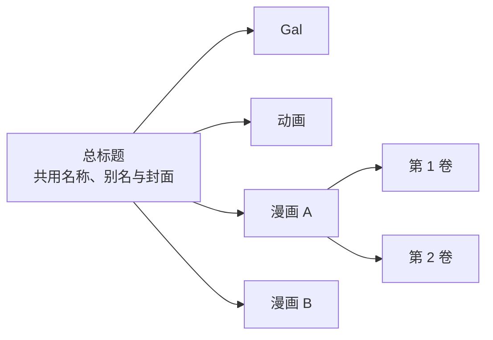
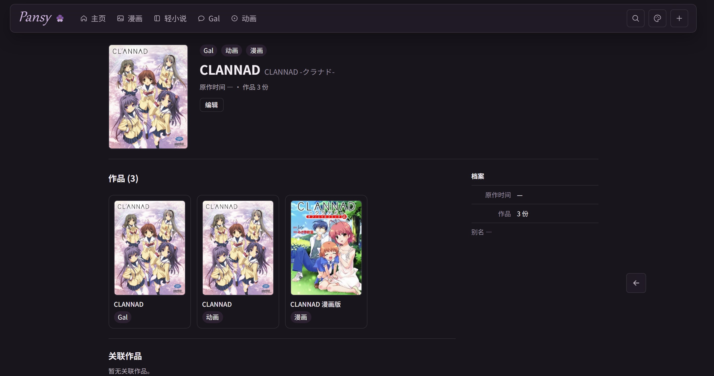

<div align="center">
  
  <h1>Pansy</h1>
  <p><strong>把散落在不同网站与文件夹里的作品，收回自己的书架。</strong></p>
  <p>面向动画、漫画、轻小说与 Gal 的本地桌面资源库。</p>
  <p>
    
    
    <a href="LICENSE"></a>
  </p>
</div>

---

Pansy 是一款桌面优先的个人 ACG 资源管理应用。它不试图再造一个公共评分站，而是帮助你整理**自己拥有、读过、看过或准备收藏的作品**：资料可以从外部来源补全，最终留下什么、怎样归类，仍由你决定。

> [!NOTE]
> 项目目前处于预览阶段，首先面向 Windows 本地使用。浏览器运行方式只作为开发预览保留，不是独立维护的产品。

## 一部作品，只留一个入口

同一标题可能同时拥有动画、漫画、轻小说与游戏，也可能存在两套彼此独立的漫画。Pansy 不会把它们摊成互不相干的搜索结果，也不会为了省事把同类型作品强行合并。



- **总标题**承载作品共同的身份与入口。
- **作品**保留每个动画、漫画、轻小说或 Gal 自己的档案。
- **卷册**记录单行本、分卷封面与本地文件位置。

## 看得见，也拿得到


<table>
  <tr>
    <td width="50%"></td>
    <td width="50%"></td>
  </tr>
  <tr>
    <td align="center">同一标题下查看不同作品</td>
    <td align="center">从作品继续整理到每一卷</td>
  </tr>
</table>

## 现在可以做什么

| | 能力 | Pansy 的处理方式 |
| --- | --- | --- |
| 🌿 | 多来源补全 | 接入 Hikarinagi、Bangumi 与 VNDB；按自己的来源顺序填充，已有信息不会被随意覆盖。 |
| 🔎 | 宽容检索 | 支持名称、别名、作者、拼音与轻微错字；短标题不会因为统一阈值而被排除。 |
| 🗂️ | 分层档案 | 总标题、每个作品和每一卷都有自己的信息与封面，同类型的不同作品仍保持独立。 |
| 🔗 | 来源追溯 | 档案保留外部条目入口，资料导入后仍可自行修改。 |
| 📁 | 本地资源 | 为作品和卷册记录本地路径，并从桌面端直接打开。 |
| 🎨 | 私人书架 | 标签、别名与分类服务于自己的收藏，不引入评分、热度等大众决策。 |

## 开始使用

### 安装桌面版

正式安装包将发布在 [GitHub Releases](https://github.com/Th1rtynine/Pansy/releases)。安装后无需另外准备 Python、Node.js 或数据库服务；Pansy 会启动自己的本地服务并创建个人资料库。

第一次使用可以按这个顺序：

1. 在设置中连接需要的数据来源，并安排导入优先级。
2. 搜索一个作品，确认预填充的信息后加入书架。
3. 在作品档案中补充卷册、本地路径和只属于自己的记录。

### 从源码开发

仓库只维护一套桌面端源码。Vue 界面与 Python 后端由桌面版共用，Tauri 负责窗口、系统浏览器、本地文件与后端生命周期。

| 想做什么 | 从这里开始 |
| --- | --- |
| 配置开发环境、运行与测试 | [开发指南](docs/development.md) |
| 理解依赖为什么存在 | [依赖说明](docs/dependencies.md) |
| 查看桌面启动与打包细节 | [桌面端说明](desktop/README.md) |
| 了解可填写的本机配置 | [配置模板](config.example.toml) |

## 数据属于用户

Pansy 的数据库、封面、来源凭据和登录会话只保存在本机，不会进入 Git 仓库。安装版使用 `%LOCALAPPDATA%\PansyData` 保存个人资料，与程序安装目录分开；源码运行使用项目根目录中的 `config.toml` 与 `data/`。

```text
data/
├── pansy.db          # 作品库
├── covers/           # 自己保存的封面
├── settings.json     # 来源与界面设置
└── *_profile.json    # 已连接来源的账号资料
```

迁移资料时应备份整个数据目录，而不只是数据库文件。`data/`、`config.toml` 与 `backups/` 均已被 Git 忽略。

## 项目结构

```text
app/                  本地 API、数据库与外部数据源
frontend/src/         桌面界面
frontend/src-tauri/   Tauri 桌面外壳
desktop/              Python 后端的桌面封装
migrations/           数据结构迁移
tests/                关系、导入与数据契约测试
scripts/              检查与打包工具
docs/                 项目文档与界面图片
```

## 技术与来源

Pansy 使用 Vue 3、FastAPI、SQLAlchemy、SQLite 与 Tauri 构建。作品资料来自用户主动连接的服务：

- [Hikarinagi](https://www.hikarinagi.org)
- [Bangumi](https://bgm.tv)
- [VNDB](https://vndb.org)

这些服务只负责提供候选资料；Pansy 不代表或隶属于上述网站。

## 许可证

Pansy 以 [MIT License](LICENSE) 开源。你可以使用、修改与分发代码，但请保留原许可证声明。
