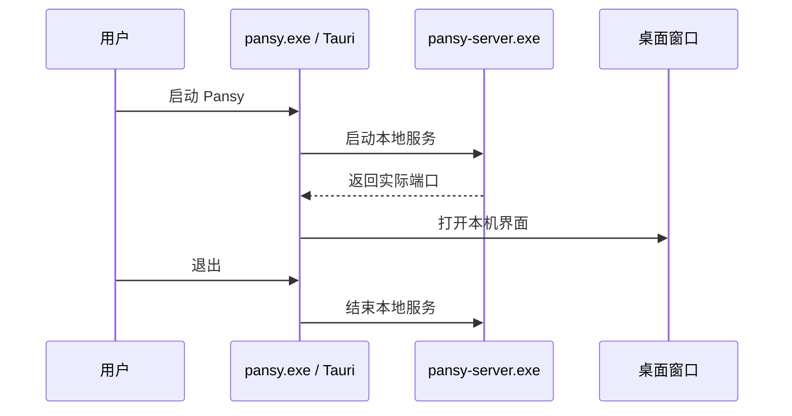

# Pansy 桌面封装

[返回项目首页](../README.md) · [开发指南](../docs/development.md) · [依赖说明](../docs/dependencies.md)

这里不是另一套 Pansy。桌面版继续使用唯一的 Vue 界面与 FastAPI 后端；本目录只负责把 Python 服务封装成 Tauri 可以管理的 sidecar。

## 启动过程



服务优先使用 `127.0.0.1:8000`。端口被占用时，Windows 会分配空闲端口，再通过一次性握手文件告诉 Tauri。Hikarinagi 的登录回调仍使用配置中的固定端口，因此登录前需要保证该端口可用。

PyInstaller 单文件程序会派生实际运行 API 的子进程。sidecar 会监视 Tauri 的进程编号，窗口退出后自行停止，避免后台服务残留。

## 数据位置

安装版使用独立的 `%LOCALAPPDATA%\PansyData`：

```text
PansyData/
├── config.toml
└── data/
    ├── pansy.db
    ├── covers/
    └── settings.json
```

源码运行仍读取项目根目录下的 `config.toml` 与 `data/`，不会覆盖安装版资料。早期预览构建曾把资料放在 `%LOCALAPPDATA%\Pansy`；新版首次启动时会把其中的 `config.toml` 与 `data/` 安全复制到新位置，且不会覆盖新位置已经存在的内容。

## 生成安装包

先按照 [依赖说明](../docs/dependencies.md) 准备发布工具，再从项目根目录执行：

```powershell
.\scripts\build-desktop.ps1
```

构建脚本依次完成：

1. 编译 Vue 界面。
2. 生成 `pansy-server.exe`。
3. 编译 Tauri 主程序。
4. 生成 NSIS 安装包。

输出目录按版本隔离，避免正在运行的旧版本锁住下一次构建：

```text
frontend/src-tauri/target/desktop-<版本号>/release/bundle/nsis/
```

首次打包会下载 NSIS。网络超时时脚本最多自动重试三次，已下载的工具会保存在 Tauri 缓存中。
