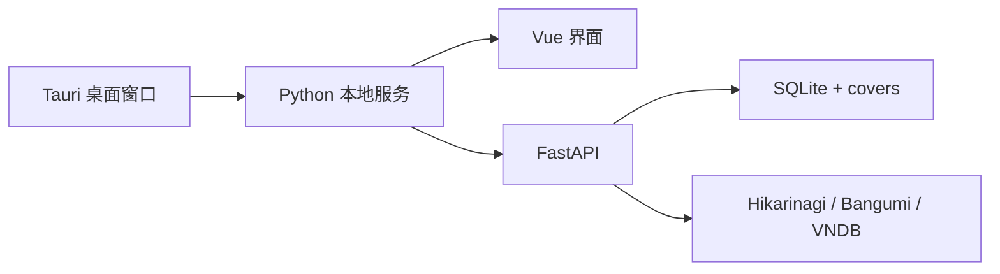

# Pansy 开发指南

[返回项目首页](../README.md) · [依赖说明](dependencies.md) · [桌面端说明](../desktop/README.md)

> [!IMPORTANT]
> Pansy 是桌面优先项目。浏览器模式用于快速调试同一套 Vue 与 FastAPI 代码，不应再拆成另一套产品或仓库。

## 开发模型



桌面程序启动时会拉起内置的 Python 服务，再让窗口访问本机地址。开发预览只是改用普通浏览器访问相同界面，业务实现没有第二份。

## 准备环境

| 工具 | 建议版本 | 用途 |
| --- | --- | --- |
| Python | 3.11 或更高 | 后端、测试与桌面后端封装 |
| Node.js | 20.19+ 或 22.12+ | Vue 开发与构建 |
| Rust | 1.77.2 或更高 | Tauri 桌面外壳 |
| Microsoft Edge WebView2 | Windows 10/11 通常已包含 | 显示桌面界面 |

完整的依赖分组与更新原则见 [依赖说明](dependencies.md)。

### 1. Python

```powershell
py -m venv .venv
.venv\Scripts\python.exe -m pip install -r requirements.txt
```

只有需要生成安装包时才安装打包依赖：

```powershell
.venv\Scripts\python.exe -m pip install -r requirements-build.txt
```

### 2. 前端

```powershell
Set-Location frontend
npm ci
npm run build
Set-Location ..
```

### 3. 本机配置

```powershell
Copy-Item config.example.toml config.toml
```

`config.toml` 与 `data/` 只属于当前电脑，已经被 Git 忽略。来源凭据也可以在 Pansy 的设置页填写。

## 快速预览界面

后端开发服务器默认运行在 `8011`：

```powershell
.venv\Scripts\python.exe -m uvicorn app.main:app --host 127.0.0.1 --port 8011
```

另开一个终端运行前端：

```powershell
Set-Location frontend
npm run dev
```

Vite 会把 `/api` 转发到 `http://127.0.0.1:8011`。如果后端换了端口，可以在启动前设置 `VITE_API_TARGET`。

## 检查与测试

```powershell
.venv\Scripts\python.exe scripts\check.py
Get-ChildItem tests\test-*.py | ForEach-Object {
    & .venv\Scripts\python.exe $_.FullName
    if ($LASTEXITCODE -ne 0) { throw "验收失败：$($_.Name)" }
}
```

`tests/` 里的文件是可单独运行的验收脚本，不依赖 pytest 或 unittest。`scripts/flow.py` 会经过真实 API 执行完整流程，适合在准备提交或发布前运行。它会暂时改动测试状态，因此运行期间不要同时在 Pansy 中保存设置或登录。

## 构建 Windows 安装包

```powershell
.\scripts\build-desktop.ps1
```

脚本依次完成 Vue 构建、Python sidecar 封装与 Tauri NSIS 打包。输出位于：

```text
frontend/src-tauri/target/desktop-<版本号>/release/bundle/nsis/
```

所有输出目录均已被 Git 忽略。安装包只上传到 GitHub Releases，不进入源码提交。

## 代码管理

| 分支/位置 | 放什么 |
| --- | --- |
| `dev` | 日常开发与阶段性检查点 |
| `main` | 已验证、能够重新打包的稳定源码 |
| GitHub Releases | 面向使用者的安装包与更新说明 |

普通修复不必立即提升版本号。一组功能稳定并准备发布时，再统一修改 Tauri 与 Cargo 中的版本并创建 Git 标签。

## 不应提交的内容

- 数据库、封面、账号资料、来源令牌与登录会话
- `.venv/`、`node_modules/` 与包管理缓存
- `frontend/dist/`、`desktop/build/`、Tauri `target/`
- sidecar、安装包、日志、崩溃文件和临时测试目录

提交前以 `git status --ignored --short` 检查边界；忽略规则集中在项目根目录与 `frontend/src-tauri/.gitignore`。
